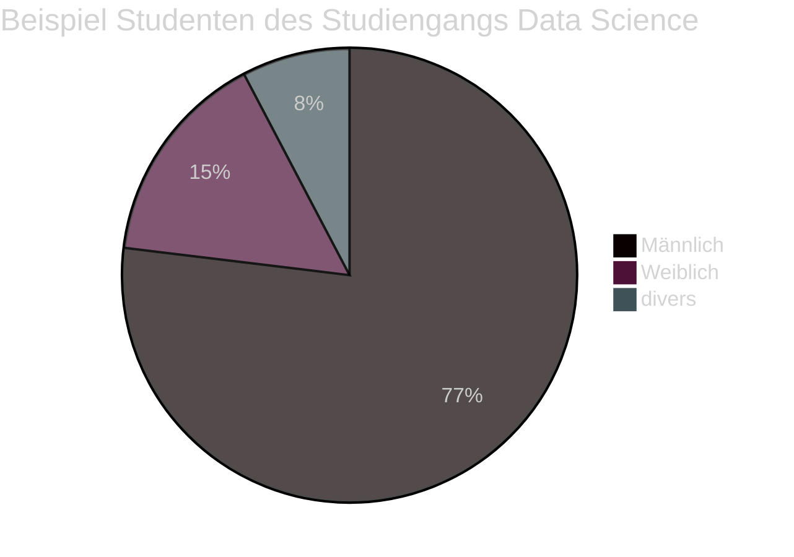
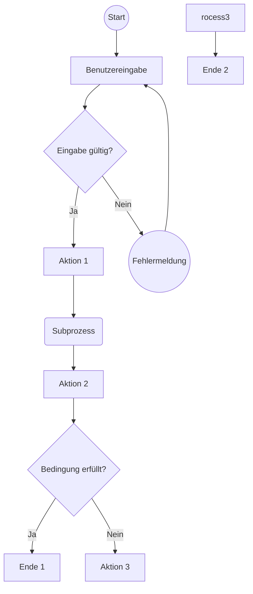
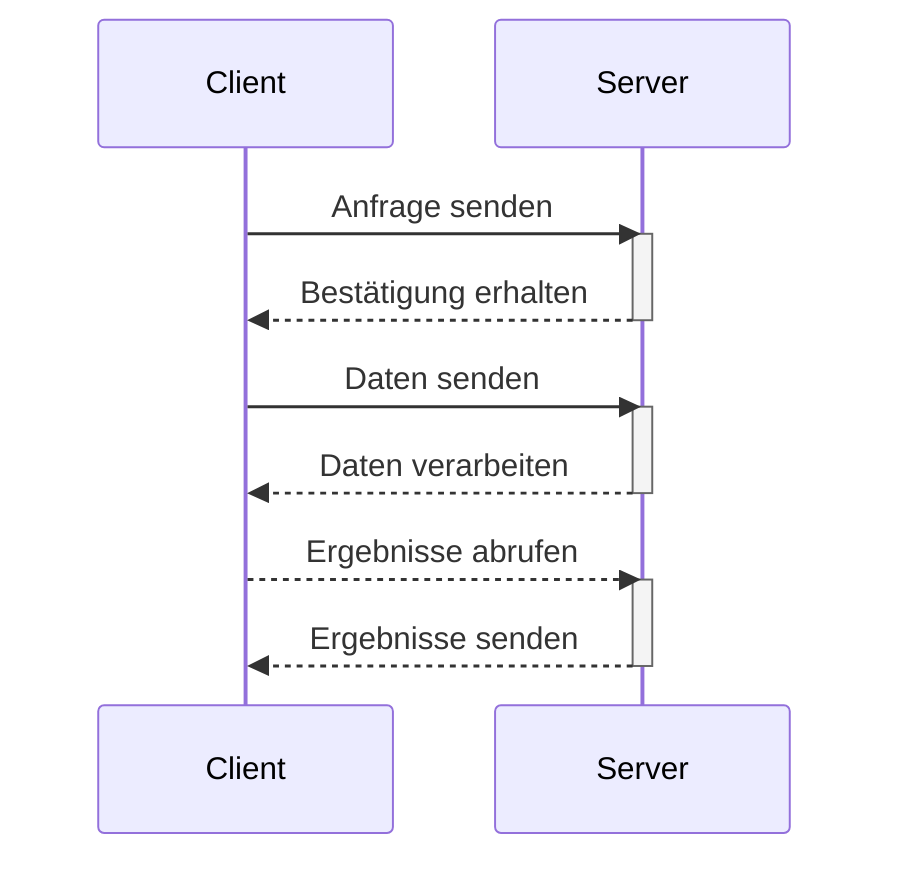
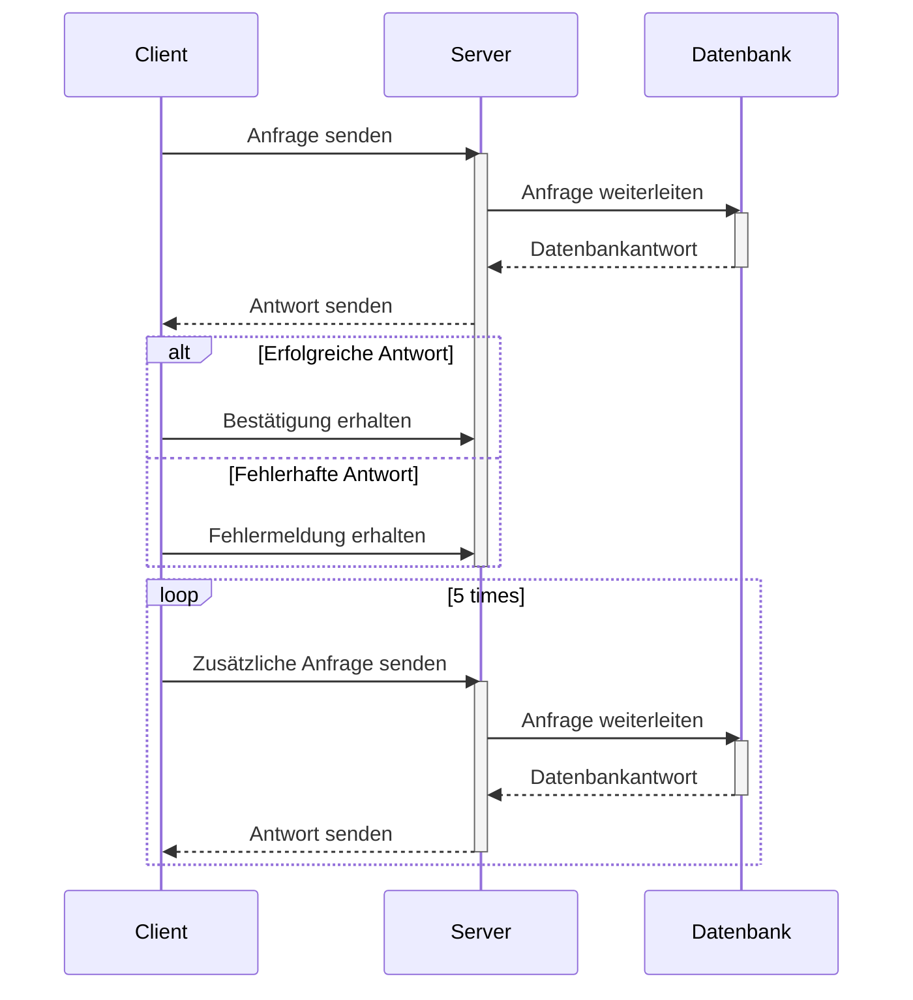
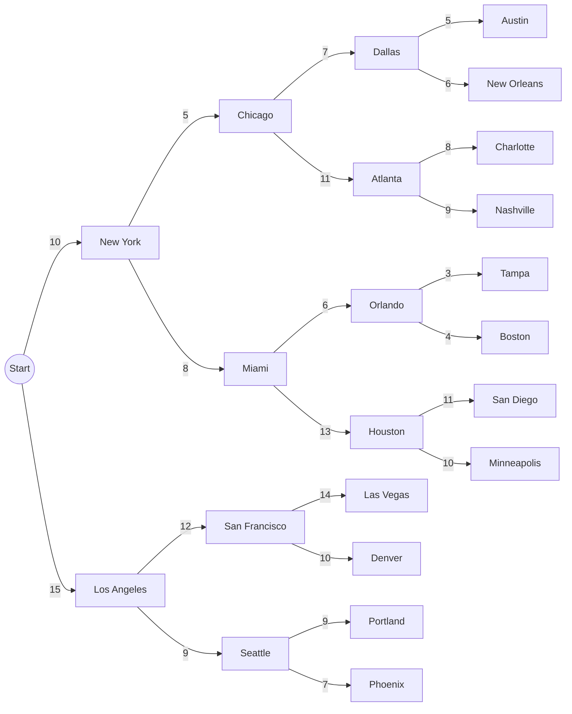

# Obsidian Visual Example
>Das folgende Dokument enthält verschiedene Arten der Visualisierung die mit Obsidian möglich sind als auch weitere Funktionen die mit Hilfe von Plugins erreichbar sind.
Der Beispiel Code ist in seiner Funktionweise Dokumentiert und kann für verschiedene Anwendungszwecke umgebaut werden.

# Datenvisualisierung
#### Tabellen

#### Säulen Diagramm
> Säulen Diagramme lassen sich ganz einfach mit <font style="color:#9966FF">Dataview</font> & <font style="color:#9966FF">Chart</font> erstellen.
##### Beispiel Barchart mit manuell eingetragenen Daten
```dataviewjs

const labels = ['One', 'Two', 'Three'];
const data = [1, 2, 3];

const chartData = {  
    type: 'bar',
    data: {
        labels: labels,
        datasets: [{
            label: 'Numbers',
            data: data,
            backgroundColor: 'rgba(153, 102, 255, 0.6)'
        }]
    }
}
this.container.style.width = '600px'
this.container.style.height = '300px'

window.renderChart(chartData, this.container);
```
##### Beispiel Barchart mit geladenen daten

```dataviewjs


```
#### Linien Diagramm
> Linien Diagramme können nur mit Hilfe von den Community Plugins <font style="color:#9966FF">Dataview</font> & <font style="color:#9966FF">Chart</font> erstellt werden.
```dataviewjs
//erstellen der Daten sowie den Labels
const labels = ['Januar', 'Februar', 'März', 'April', 'Mai', 'Juni', 'Juli', 'August', 'September', 'Oktober', 'November', 'Dezember'];
const verkaufszahlen = [100, 120, 110, 130, 140, 125, 135, 150, 145, 160, 155, 170];
const kosten = [80, 90, 85, 95, 100, 88, 92, 98, 97, 105, 102, 110];

// Chart erstellen
const chartData = {
	// Chart Type definieren
	type: 'line',
	// Daten für den Chart definieren
	data: {
		labels: labels,
		// erste linie für die Verkaufzahlen
		datasets: [{
			label: 'Verkaufszahlen im Jahr',
			data: verkaufszahlen,
			borderColor: 'rgba(153, 102, 255, 1)',
			backgroundColor: 'rgba(153, 102, 255, 0.2)',
			borderWidth: 2
			},
			// zweite linie für die Kosten
			{
			label: 'Kosten im Jahr',
			data: kosten,
			borderColor: 'rgba(255, 99, 132, 1)', // Rote Farbe für die Kostenlinie
			backgroundColor: 'rgba(255, 99, 132, 0.2)', // Hintergrundfarbe für den Bereich unterhalb der Linie
			borderWidth: 2 }] } }

this.container.style.width = '600px'
this.container.style.height = '300px'

window.renderChart(chartData, this.container);
```

#### Kombinierte Diagramme
> Diese können auch nur mit Hilfe der beiden Plugins erstellt werden, da es die Möglichkeiten von Mermaid übersteigt.
```dataviewjs
const labels = ['Januar', 'Februar', 'März', 'April', 'Mai', 'Juni', 'Juli', 'August', 'September', 'Oktober', 'November', 'Dezember'];
const verkaufszahlen = [100, 120, 110, 130, 140, 125, 135, 150, 145, 160, 155, 170];
const kosten = [80, 90, 85, 95, 100, 88, 92, 98, 97, 105, 102, 110];

// Berechnen des Gewinns
const gewinn = verkaufszahlen.map((value, index) => value - kosten[index]);

// Berechnen des kumulierten Gewinns
const kumulierterGewinn = gewinn.reduce((acc, value, index) => {
	if (index === 0) {
	acc.push(value);
	} else {
	acc.push(acc[index - 1] + value);
	}
	return acc;
	}, []);

const chartData = {
	type: 'line',
	data: {
		labels: labels,
		datasets: [
			{
				label: 'Verkaufszahlen im Jahr',
				data: verkaufszahlen,
				borderColor: 'rgba(153, 102, 255, 1)',
				backgroundColor: 'rgba(153, 102, 255, 0.2)',
				borderWidth: 2
			},
			{
				label: 'Kosten im Jahr',
				data: kosten,
				borderColor: 'rgba(255, 99, 132, 1)',
				backgroundColor: 'rgba(255, 99, 132, 0.2)',
				borderWidth: 2
			},
			{
				type: 'bar', // Barchart für den Gewinn
				label: 'Gewinn im Jahr',
				data: gewinn,
				backgroundColor: 'rgba(75, 192, 192, 0.2)', // Hintergrundfarbe für die Balken
				borderColor: 'rgba(75, 192, 192, 1)', // Farbe der Balken
				borderWidth: 1
			},
			{
				label: 'Kummulierter Gewinn',
				data: kumulierterGewinn,
				borderColor: 'rgba(255, 206, 86, 1)', // Gelbe Farbe für den durchschnittlichen Gewinn
				backgroundColor: 'rgba(255, 206, 86, 0.2)', // Hintergrundfarbe für den Bereich unterhalb der Linie
				borderWidth: 2
			}
		]
	}
};

this.container.style.width = '600px'
this.container.style.height = '300px'

window.renderChart(chartData, this.container);
```
#### Pie-Chart
> Grundsätzlich benötigt Obsidian für die Verwendung von Pie-Charts keine weiteren Community Plugins jedoch sehen diese Optisch durch die Verwendung von **<font style="color:#9966FF">Dataview</font>** in Kombination mit <font style="color:#9966FF">Chart</font> deutlich anschaulicher aus.
##### Mermaid Lösung

##### Dataviewjs lösung
> Durch das klicken in das Diagramm können Filter aktiviert werden! :)
```dataviewjs
const labels = ['Männlich', 'Weiblich', 'divers'];
const data = [20, 4, 2];

const chartData = {  
    type: 'pie',
    data: {
        labels: labels,
        datasets: [{
            label: 'Numbers',
            data: data,
            backgroundColor: ['rgba(0, 0, 128, 0.8)', 'rgba(153, 102, 255, 0.8)', 'rgba(204, 204, 204, 0.8))']
        }]
    }
}
this.container.style.width = '500px'
this.container.style.height = '500px'


window.renderChart(chartData, this.container);
```
# Andere darstellungs formen
#### Fluss Diagramm
> Flussdiagramme können ohne weitere Obsidian Community Plugins erstellt werden.
##### Mermaid

#### Sequenzdiagramm
> Sequenzdiagramme können ohne weitere Obsidian Community Plugins erstellt werden.
##### Mermaid
###### Einfaches Beispiel

###### Komplexeres Beispiel


#### Graphen


